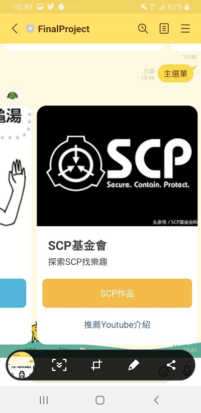
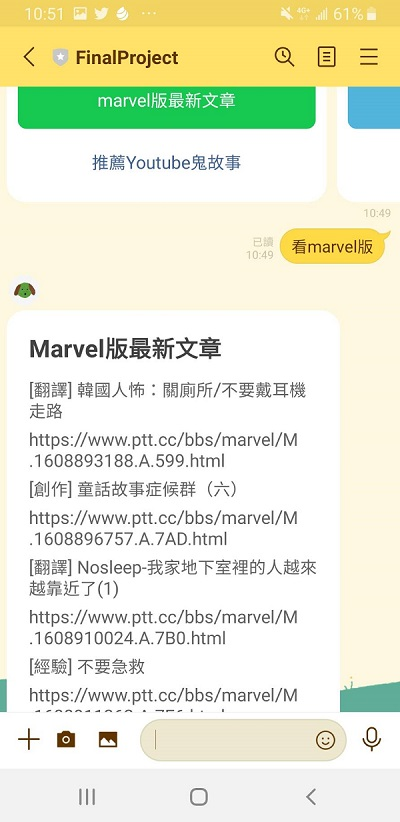
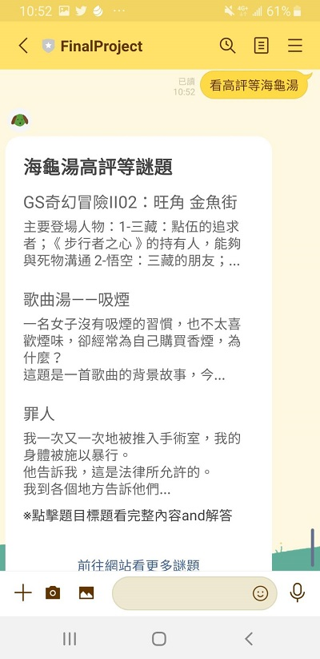

# TOC2020_Final
## 發想
TOC2020_Final 主要為作者本人的興趣推廣，以及提供給想要隨時可以找到最新的謎題和影片來看的人所做。

## 環境
* windows 10
* python 3.6.8
## QRCode

## Finite State Machine

## 操作
* 呼叫主選單 選擇有興趣的區塊進入
* 
* 
* 

* marvel版最新鬼故事
* 

* youtube鬼故事推薦
* 

* 海龜湯謎題可選擇最新或是高評等 點標題可進入解答或答題
* 
* 最新海龜湯
* 

* 高評等海龜湯
* 

* youtube海龜湯推薦
* 

* SCP介紹和網站連結
* 
* youtubeSCP推薦
* 

## Reference
* [海龜湯](http://gameschool.cc/turtlesoup/all/?o=date) 
* [marvel版](https://www.ptt.cc/bbs/marvel/index.html)

### qq
* 用到heroku沒反應
* 12.27更新 成功了 不要在本地端(app.py 115行)call # machine.get_graph().draw("fsm.png", prog="dot", format="png") 
